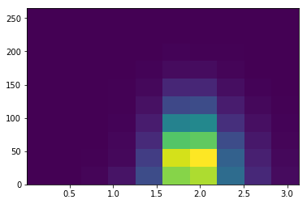

# Preliminary analysis and fast estimation

* **Type**: Use case
* **Author**: Mikhail Zelenyi
* **Status**: 
* **Discussion**: [](None)

For scientist, a programming language is tools before anything, which on the on hand must be safety, but is  no less important than it was user-friendly. I think, what scientist need more often than others in writing of one-off code, because he have to check many dead end idea nad hypothesis. About last case, I want to discuss in this document.

Consider next example. I have some data, which I get as binary block. Data is sequence of events, where every event is set of 4 double parameters. I want load this data, histogrammate by second and third parameters, and look at corelation coeficient between first and second parameter. Let made this on python.
 Import necesary module:
```python
import numpy as np
import matplotlib.pyplot as plt
```
Load data:
```python
data = np.fromfile(filename, dtype='d')
data = data.reshape((data.shape[0]//4, 4))
```
Or more accuracy:
```python
data = np.fromfile(filename, dtype=[(a, 'd') for a in ["a1", "a2", "a3", "a4"]])
```
Histogrammate:
```python
hist, binsx, binsy = np.histogram2d(data['a2'], data['a3']) 
```
Or create plot:
```python
hist, binsx, binsy, _ = plt.hist2d(data['a2'], data['a3']) 
```


Count correlation:
```python
np.corrcoef(data['a1'], data['a2'])
```
    array([[ 1.        ,  0.41185499],
           [ 0.41185499,  1.        ]])

Several line of code  and I already known, what my supervisor will send me to remake all work.

How conclusions can we make from this example? It can be noted that this code is declarative rather than imperative, I do not describe in detail what I should do with the data, I just say: load data, make histogramm. For comparasion, for loading data on Kotlin, I must make this for example:
```kotlin
data class Data(
        val a1: Double,
        val a2: Double,
        val a3: Double,
        val a4: Double
)

fun readBinFile(file: File): Sequence<Data> {
    val buf = ByteBuffer.allocate(32)
    buf.order(ByteOrder.LITTLE_ENDIAN)

    return sequence {
        Files.newByteChannel(file.toPath(), StandardOpenOption.READ).use { channel ->
            do {
                val num = channel.read(buf)
                if (num > 0) {
                    buf.flip()
                    val point = Data(buf.double, buf.double, buf.double, buf.double)
                    buf.clear()
                    yield(point)
                }
            } while (num > 0)
        }
    }
}
```
Only data loading request code more than all processing on Python. Of course in a big project this will not be a problem, but in time when I want just  fast to look at data for checking  some simple ideas, I don't want to write a sheet of code. I want to make something as:
```kotlin
val data = read(filename, type=Data:class)
```
Or building of histogramm: for example, if I want use  [hep.aida](https://dst.lbl.gov/ACSSoftware/colt/api/hep/aida/package-summary.html), I must be create factory, next create histogramm and only later I can feel histogramm --- three action instead one action. 
In addition, there is a separate issue of performance, for example, the existing solution in [kmath](https://github.com/altavir/kmath) is good in terms of thread safety, but memory consumption in the case of processing data with large dimensions is redundant and leads to high GC load.

As a conclusion, it can be said that creating a compact and convenient Scientific DSL should be one of the goals realized when developing a library for scientific programming, and this DSL should be made similar to the Matlab / Python syntax to facilitate the transition.
